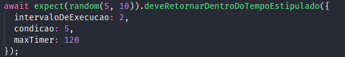
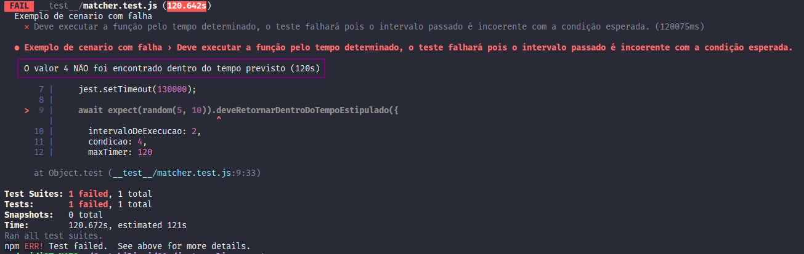

# jest-pooling
Custon Matcher do jest para pooling de execução de funções assincronas.

## Modo de usar

Copie o conteúdo da pasta src para o seu projeto.

Importe o arquivo [deveRetornarDentroDoTempoEstipulado.js](./src/matcher/deveRetornarDentroDoTempoEstipulado.js) sem adicionar uma variável para o mesmo, como mostrado abaixo:

O matcher é dividido em duas partes, primeiro, a função que será chamada deve ser passada dentro do __expect__. Na função __deveRetornarDentroDoTempoEstipulado__ deve ser passado um objeto com os seguintes atributos:

* intervaloDeExecucao - Este valor indica a cadência de execução da função em segundos, ou seja, de quanto em quanto tempo a função passada no __expect__ deve ser chamada. O valor defalut deste campo é 2s.

* maxTimer - Este valor indica o tempo máximo de duração do teste em segundos. O valor default deste campo é 10s.

* condicao - Este valor representa a condição que indica se o teste passou ou não. O teste será encerrado quando o retorno da função contida no __expect__ for igual ao informado neste campo. O valor default é 0 (zero).

Como exemplo o teste abaixo será resolvido com sucesso se em menos de 120 segundos (maxTimer), a função random (expect) retornar o valor 5 (condição). O sistema disparará a função random de dois em dois segundos.

Em caso de falha, a seguinte mensagem será apresentada no console:

